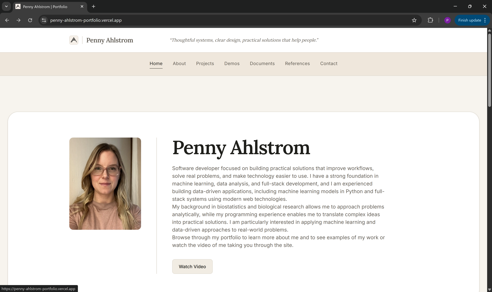
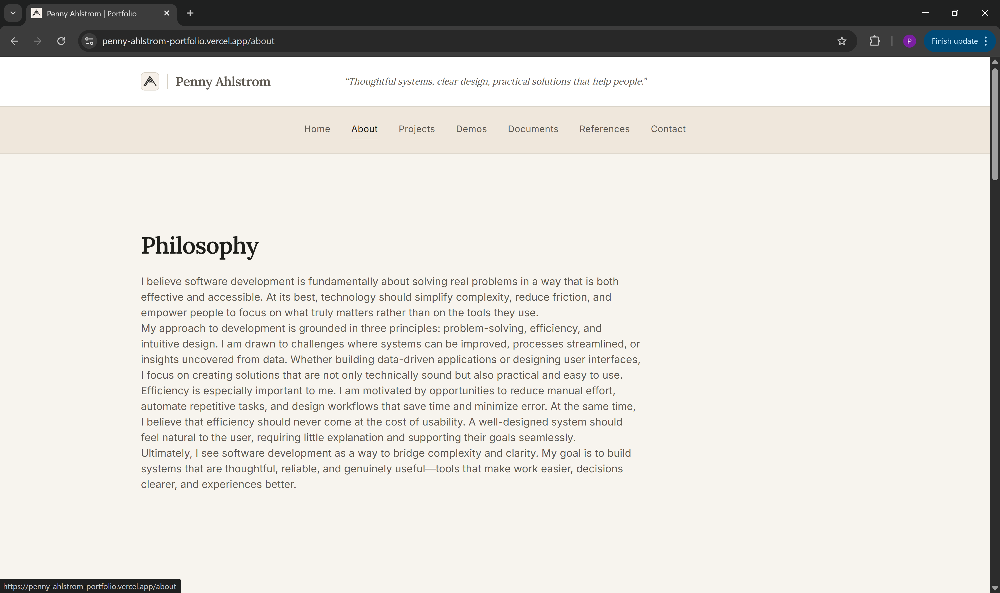
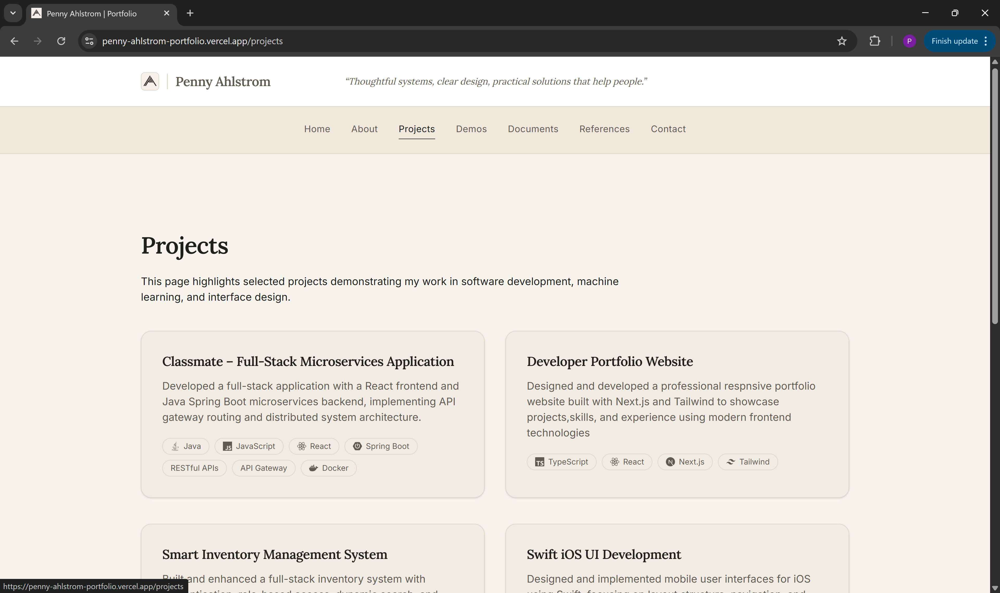
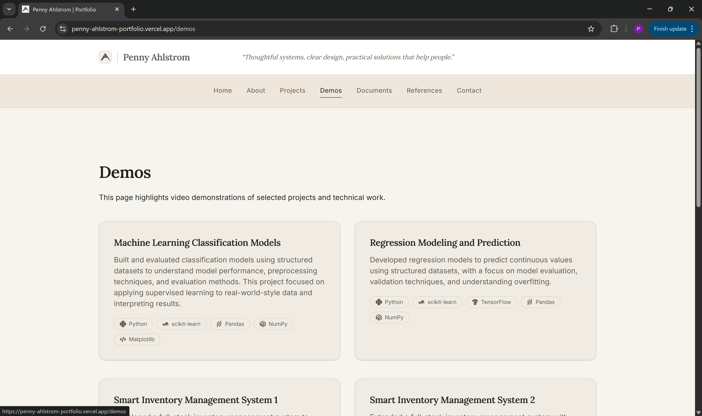
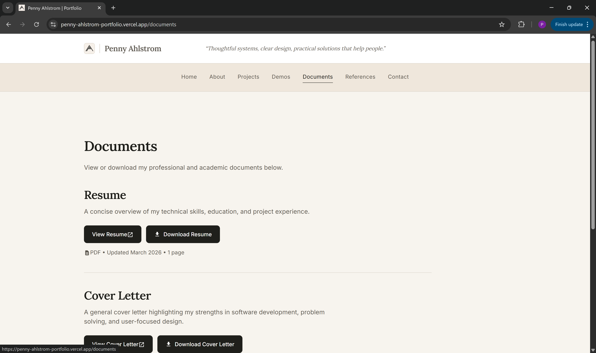
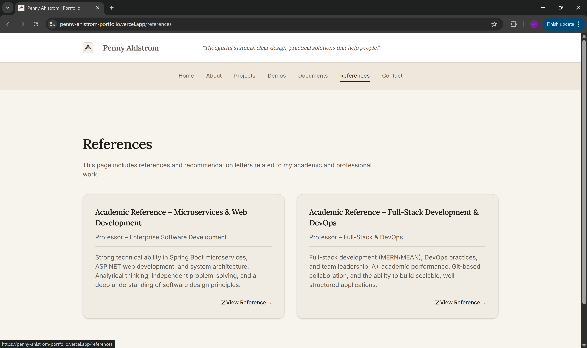
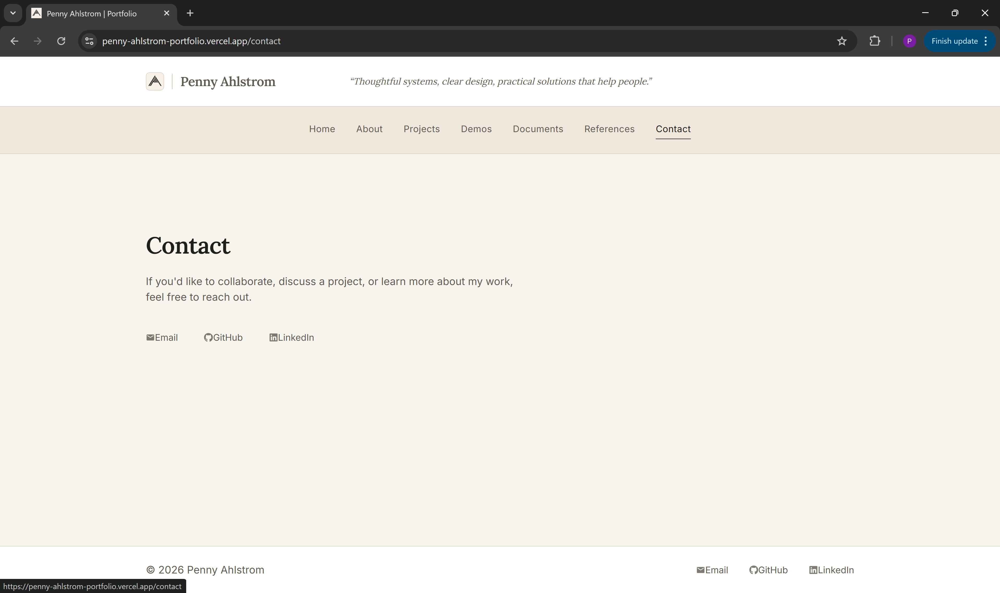

# Online Portfolio

A modern, responsive portfolio built with Next.js and Tailwind CSS, designed to showcase projects, technical skills, and development experience in a clean, structured format.
Built with a focus on clean UI, reusable components, and strong frontend fundamentals.

## Live Site

https://penny-ahlstrom-portfolio.vercel.app/

---

## Screenshots

### Home
  
*Structured landing page with clear navigation and a focused layout, designed to guide users quickly to key sections of the portfolio.*

### About
  
*Professional overview highlighting background, skills, and approach, with a balance of technical detail and personal context.*

### Projects
  
*Organized project showcase with clear presentation of technologies and direct access to detailed project pages.*

### Demos
  
*Interactive demonstrations and embedded content showcasing practical implementations and real-world functionality.*

### Documents
  
*Centralized document viewer providing easy access to resume, coverletter and unofficial transcript.*

### References
  
*Academic references presented in a clean, accessible format.*

### Contact
  
*Contact interface with email button as well as links to GitHub and LinkedIn.*

---

## Overview

* Multi-page layout (Home, About, Resume, Projects, Demos, References, Contact)
* Resume viewer for PDF
* Project pages with technologies and detailed descriptions
* Demo section with embedded content (Vimeo)
* Consistent, reusable component-based design system

---

## Tech Stack

* Next.js (App Router)
* TypeScript
* Tailwind CSS
* Vercel (Deployment)

---

## Architecture

The project is built with a focus on scalability and consistency:

* Reusable layout components (`SectionWrapper`, `Container`)
* Shared UI system (Button, Text, SectionHeader, AppLink)
* Variant-based styling (`light`, `dark`, `muted`)
* Centralized project and demo data

---

## Project Structure

```bash
/app
/components
  /layout
  /ui
  /projects
/public
/styles
```

---

## Local Development

```bash
git clone https://github.com/PennyAhlstrom/my-portfolio.git
cd online-portfolio
npm install
npm run dev
```

---

## Deployment

Deployed using Vercel.
Each push to the main branch triggers an automatic deployment.

---

## Resume

Available directly on the site:

* Opens in a new tab
* Downloadable as a PDF

---

## Contact

Available via the contact page on the website.

---

## Notes

This portfolio is actively being refined with ongoing improvements to UI, performance, and overall user experience.
